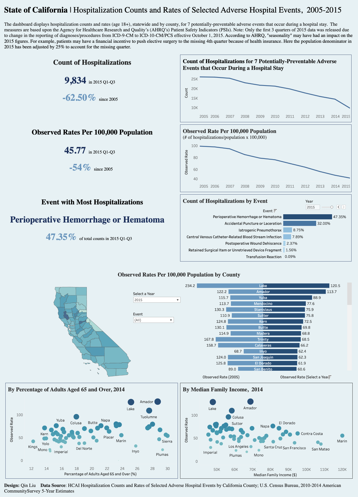
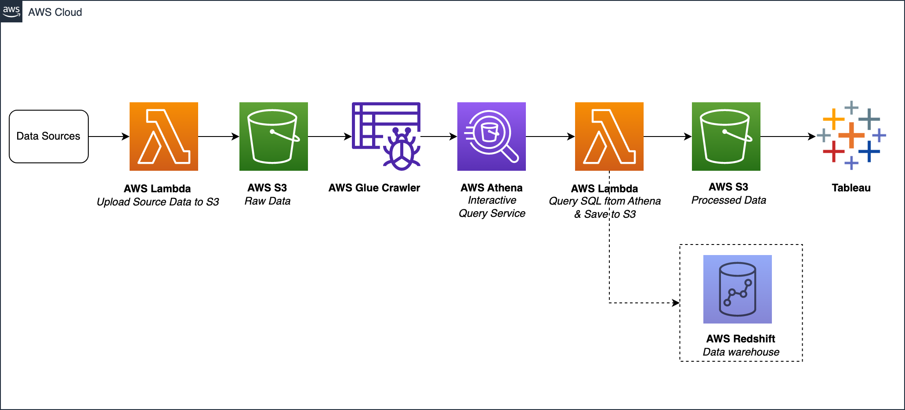
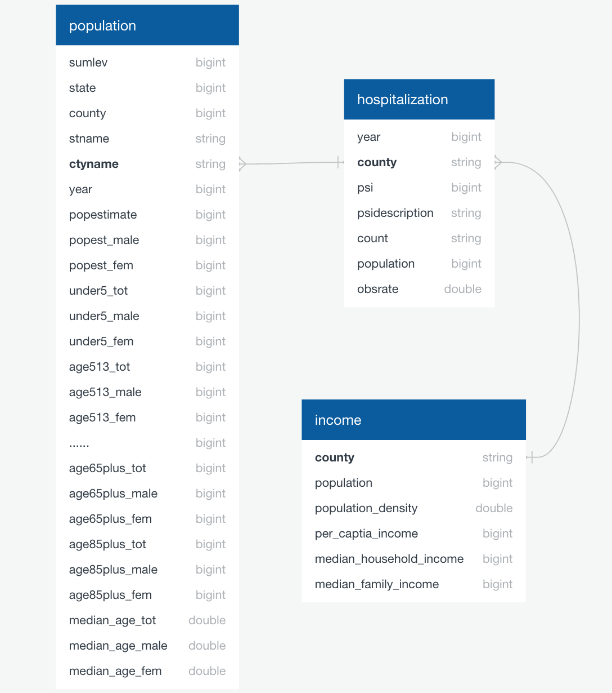

# California Hospitalization Data ETL Pipeline

## TABLE OF CONTENTS

* [Introduction](#introduction)
* [Pipeline Architecture](#pipeline-architecture)
* [Data Source](#data-source)
* [Extract, Transform and Load](#extract-transform-and-load)
* [Future Analysis](#future-analysis)

## Introduction
In this project, I developed an ETL (Extract, Transform, and Load) pipeline using Python, SQL, and AWS to analyze hospitalization data of California. The raw data from three different sources was stored in AWS S3 to enable reuse, and the cleaned data was saved back to S3 after processing with SQL. Finally, the results were visualized using Tableau. This pipeline can be easily extended to analyze additional healthcare data in the future.

Data visualization by Tableau dashboard:

[View it in Tableau](https://public.tableau.com/app/profile/qinliu/viz/CaliforniaHospitalizationCountsandRatesofSelectedAdverseHospitalEvents/Dashboard1)

  

## Pipeline Architecture

  

## Data Source
[California Hospitalization Counts and Rates of Selected Adverse Hospital Events](https://data.chhs.ca.gov/dataset/hospitalization-counts-and-rates-of-selected-adverse-hospital-events-by-california-county-2005-2014): The dataset contains hospitalization counts and rates (age 18+), statewide and by county, for 7 potentially-preventable adverse events that occur during a hospital stay.

[U.S. Census: California County Population](https://www.census.gov/programs-surveys/popest/technical-documentation/research/evaluation-estimates/2020-evaluation-estimates/2010s-county-detail.html): The dataset contains county population estimates by demographic characteristics, 2010-2020.

[California Locations by Income](https://en.wikipedia.org/wiki/List_of_California_locations_by_income): The data should sourced from American Community Survey, 2010-2014 American Community Survey 5-Year Estimates by the U.S. Census Bureau. However, it's no longer available on the official website. Need to scrape from Wikipedia.

## Extract, Transform and Load

- Extract: Those source data can be extracted and saved to [AWS S3](https://aws.amazon.com/pm/serv-s3/) by [AWS Lambda](https://aws.amazon.com/lambda/), see the script [extract and upload using Python](https://github.com/eeliuqin/California-Hospitalization-Data-ETL-Pipeline/blob/main/extract-upload-to-s3.py).

- Transform and Load: With [AWS Glue Crawler](https://docs.aws.amazon.com/glue/latest/dg/add-crawler.html), S3 files can be analyzed as tables in [AWS Athena](https://aws.amazon.com/athena/) using SQL. The data schema:

  

The SQL query should contain:
- Group hospitalization data by year and county to get total data for each county
- Get the percentage of adults over the age of 65 for each county
- Join tables by county names while resolving redundant words in population data

Then use Lambda function to execute the SQL query and save the processed data to S3 for future analysis, see the script [process and save data using SQL and Python](https://github.com/eeliuqin/California-Hospitalization-Data-ETL-Pipeline/blob/main/sql-process-save-to-s3.py).

## Future Analysis

Currently the processed data is only loaded to S3, because the volume of California hospitalization data is relatively small. In the future, we can add more healthcare-related data, such as readmission rates and mortality rates. At that time, by adding a data warehouse (such as AWS Redshift) to the pipeline, we can query and analyze more comprehensive California Healthcare data.
